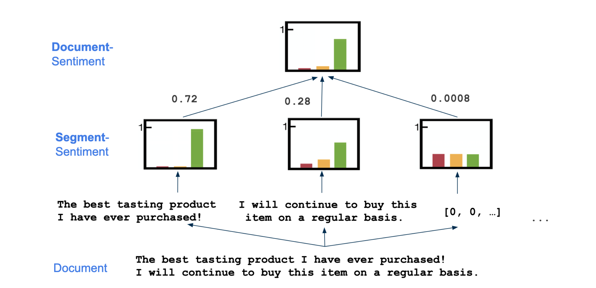
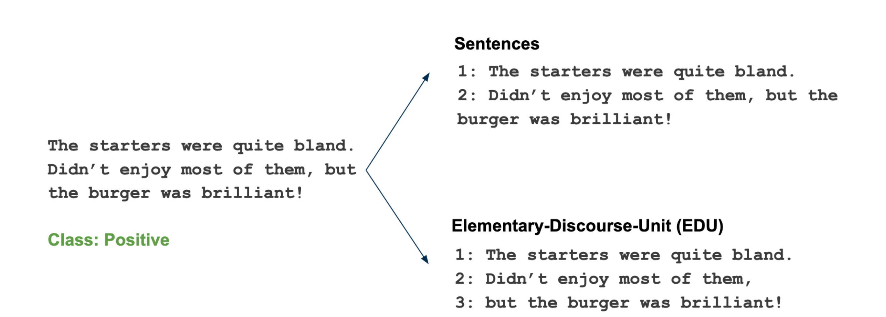
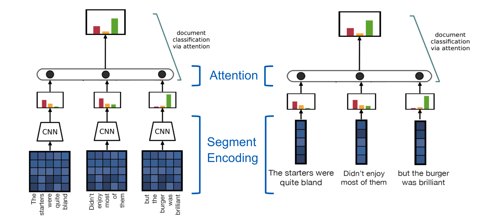
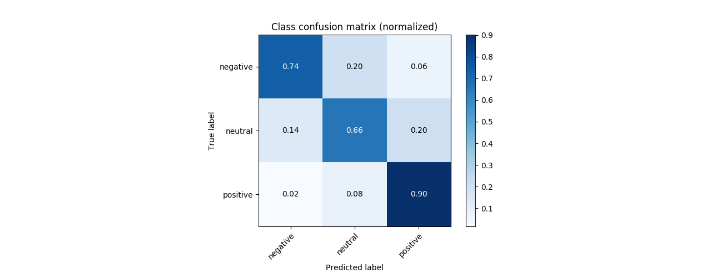

# NLP Lab Group9

### Topic

Comparing Aspect-Based Sentiment Analysis Classification of Discourse Units and Sentences
Detailed descriptions are in our report.

### Description

The most common approach for sentiment analysis is to regard the documents as atomic entities and predict their sentiment as a whole, even though documents often convey a mixture of positive and negative sentiment. Learning to separate those sub-document sentiments is especially important for the task of opinion summarization. This gave rise to the idea of splitting documents into fine-grained segments and using multiple instance learning (MIL) to classify each segment independently. Those separate sentiments are then combined into a document sentiment [1]

Using a Rhetorical Structure Theory (RST) parser (Feng and Hirst, 2014) one can parse the document into sub-sentence units, so-called elementary discourse units (EDUs).
We compared the sentence level document segmentation against the EDU level segmentation.

We also compared the use of sentence level segmentation against using word embeddings directly (bvoth using an attention layer)

The following are the F1-Macro scores for the network results on the amazon electronics reviews using sentence level segmentation:
.
For more details please take a look at our report. 

### References

[https://arxiv.org/pdf/1808.08858.pdf](https://arxiv.org/pdf/1808.08858.pdf)

Fast Rhetorical Structure Theory (RST) Discourse Parser - GitHub (also watch out for maybe better alternatives and related work!)

XLING

[https://inception-project.github.io/](https://inception-project.github.io/)

Data

Amazon product review data

Social Media Comments from the Non-annotated Organic Dataset
