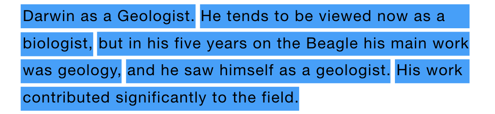
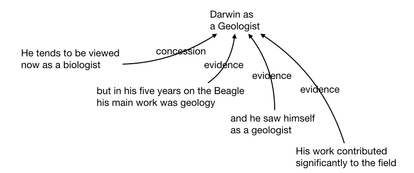
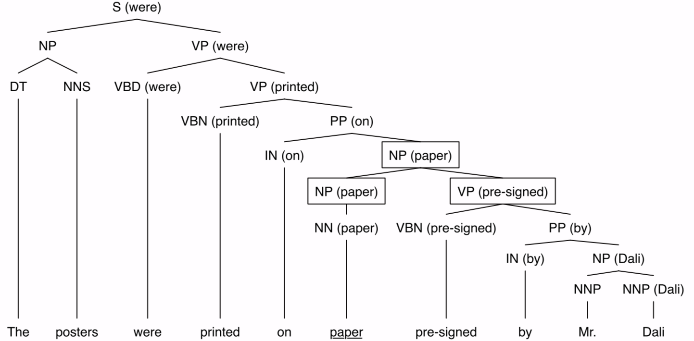

### A Brief Introduction about discourse Segmentation

Since the project requires us to compare the sentiment analysis result between discourse units and sentences level features, we need to extract the discourse units from the documents first， which could be extracted by RST parsers. Basically, in the rhetorical structure theory, the discourse unit refers to the simple sentence or clause in a complex sentence. Here is an exapmle of the discourse units in a complex sentence.

Besides the segmentation, an important goal of the rhetorical structure theory is to analyze the relationship between the discourse units, such as 'background' or 'elaboration', and label the discourse units with nucleus and satellite, which could help to explain the theme of the sentence. Here is an example about the relationship between the discourse units.

The RST parsing has 2 steps: 1) segmentation: split the sentence to discourse units 2) parsing: give the relationship between discourse units. However, to extract the DU-wise feature with XLING, the relationship of the discourse units is not necessarily required, and we could implement a RST parser that only do the segmentation step in our future work, which could make the discourse unit feature extraction faster. Thus we focus more on the segmentation step today, several methods of discourse segmentation would be illustrated.

##### Rule Based Segmentation

Basically, there are the following 4 rules to decide the discourse units of a sentence. (Though they wrote a manual of more than 160 pages to illustrate this)

- The clause that is attached to a noun phrase can be recognized as an embedded unit. If the clause is a subordinate clause, it must contain more than one word.
- Coordinate clauses and coordinate sentences of a complex sentence are EDUs.
- Coordinate clauses and coordinate elliptical clauses of verb phrases (VPs) are EDUs. Coordinate VPs that share a direct object with the main VP are not considered as a separate discourse segment.
- Clausal complements of reported verbs and cognitive verbs are EDUs.

##### Statistical Discourse Segmenter

In RST-DT dataset, there are articles, each paired with a discourse structure tree built in the style of rhetorical structure theory.

The discourse segmentation is considered as a classification problem, that is, given a word $w$, try to label the word with the labels $\{boundary, non-boundary\}$. The lexical and syntatic features are used, specifically, by applying canonical lexical head projection rules, we could fuse the word in the sentence with the syntactic tree, now the node in the tree looks like `VBZ(says)` or `SBAR(will)`, or etc. For each node $N_w$, $N_p$ refer to its parent, and $N_r$ refer to its next sibling.

By applying the following formula, we could give the probability of a certain word to be a boundary:
$$
P(b \vert w, t) = \frac{Cnt \left( N_p \rightarrow ... N_w \uparrow N_r ... \right) }{Cnt \left( N_p \rightarrow ... N_w N_r ... \right) }
$$

> Note:
>
> By combining the syntactic feature with the lexical feature, some problems would be avoided, such as `VBN(passed)` `PP(without)` and `VPN(priced)` `PP(at)`.

After obtaining the probabilities of each word, we could regard the word $w$ which $P(boundary \vert w, t) > 0.5$ as the boundary and get the segmentation.

##### Neuron Network Discourse Segmenter

> Since the problem is still considered as a classification problem, and the feature set is similiar to the previous model, I just introduced this model in brief.

With data from RST-DT dataset, a multi-layer perception model was built to tackle the classification problem.

##### Sequential Discourse Segmenter

Still with RST-DT dataset, a sequential model could also be built to be used for discourse segmentation. The sequential discourse segmenter consider the problem as a sequence labelling problem, that is, for a word sequence, it gives a label sequence, indicating whether each term of the word sequence is a beginning of a discourse unit or a continuation of a discourse unit. The probability of a label sequence $y$ is defined as follows:
$$
p(y \vert x) = \frac{1}{Z \left( x \right)} \exp \left( \sum_{j=1}^{n} \sum_{i=1}^{m} \lambda_i f_i \left( y_{j-1}, y_j, x_j \right) \right)
$$
Among which $\lambda$ is the trainable parameter, $Z(x)$ is the regulation term (Make the sum of the probabilities equal to 1).

Given the training dataset $T = \{ \left( x_j, y_j \right) \}_{j=1}^{N}$, the log likelihood of the dataset is represented as follows:
$$
L_\Lambda = \sum_{j=1}^{N} \log \left( p \left( y_j \vert x_j \right) \right)
$$
For each term, the compose of the word, the POS, the POS and lexical head of $N_w$, $N_p$ and $N_r$ is considered (definitions of these symbols see previous section). The features would be encoded, and gradient descent is adopted to train the model, say, maximize the log likelihood $L_\Lambda$.